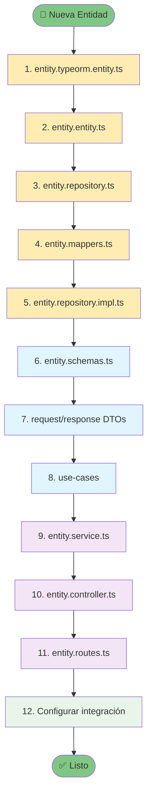

# 🏗️ Clean Architecture - Node.js TypeScript Project

## 📋 Descripción

Este proyecto implementa **Clean Architecture** con Node.js, TypeScript, Express y TypeORM, siguiendo los principios de separación de responsabilidades e inversión de dependencias.

## 🗂️ Estructura de Carpetas

```
src/
├── 📁 application/                    # Capa de Aplicación
│   ├── 📁 dtos/                       # Data Transfer Objects
│   │   ├── 📁 request/                # DTOs de entrada
│   │   │   └── 📁 user/
│   │   │       ├── create-user-request.dto.ts
│   │   │       ├── get-user-request.dto.ts
│   │   │       ├── get-users-request.dto.ts
│   │   │       ├── update-user-request.dto.ts
│   │   │       └── delete-user-request.dto.ts
│   │   └── 📁 response/               # DTOs de salida
│   │       └── 📁 user/
│   │           ├── user-response.dto.ts
│   │           ├── users-response.dto.ts
│   │           └── delete-user-response.dto.ts
│   ├── 📁 schemas/                    # Esquemas de validación (Zod)
│   │   └── 📁 user/
│   │       └── user.schemas.ts
│   └── 📁 use-cases/                  # Casos de uso (Lógica de aplicación)
│       └── 📁 user/
│           ├── create-user.use-case.ts
│           ├── get-user.use-case.ts
│           ├── get-users.use-case.ts
│           ├── update-user.use-case.ts
│           └── delete-user.use-case.ts
│
├── 📁 domain/                         # Capa de Dominio
│   ├── 📁 entities/                   # Entidades de dominio
│   │   ├── user.entity.ts
│   │   └── user-props.interface.ts
│   └── 📁 repositories/               # Interfaces de repositorios
│       └── user.repository.ts
│
├── 📁 infrastructure/                 # Capa de Infraestructura
│   ├── 📁 adaptadores/                # Adaptadores para servicios externos
│   │   ├── 📁 encryption/
│   │   │   ├── encryption.interface.ts
│   │   │   └── bcrypt.adapter.ts
│   │   ├── 📁 jwt/
│   │   │   ├── jwt.interface.ts
│   │   │   └── jwt.adapter.ts
│   │   ├── 📁 uuid/
│   │   │   ├── uuid.interface.ts
│   │   │   └── uuid.adapter.ts
│   │   └── index.ts
│   ├── 📁 controllers/                # Controladores HTTP
│   │   └── user.controller.ts
│   ├── 📁 database/                   # Configuración de base de datos
│   │   ├── 📁 config/
│   │   │   ├── database.config.ts
│   │   │   └── env.ts
│   │   └── 📁 entities/               # Entidades TypeORM
│   │       └── user.typeorm.entity.ts
│   ├── 📁 middlewares/                # Middlewares
│   │   └── ensureInitialized.middleware.ts
│   ├── 📁 repositories/               # Implementaciones de repositorios
│   │   ├── user.repository.impl.ts
│   │   └── 📁 mappers/
│   │       └── user.mappers.ts
│   ├── 📁 routes/                     # Configuración de rutas
│   │   ├── index.ts
│   │   └── 📁 v1/
│   │       ├── index.ts
│   │       └── user.routes.ts
│   ├── 📁 services/                   # Servicios de infraestructura
│   │   ├── controller.service.ts
│   │   └── user.service.ts
│   ├── 📁 utils/                      # Utilidades
│   │   └── 📁 logger/
│   │       └── index.ts
│   └── server.ts                      # Configuración del servidor
│
├── 📁 interfaces/                     
│   ├── 📁 http/
│   │   └── 📁 controllers/
│   └── 📁 email/                      
│       ├── 📁 layouts/
│       │   └── main.hbs
│       ├── 📁 partials/
│       │   ├── header.hbs
│       │   └── footer.hbs
│       ├── 📁 user/                   # Templates por dominio
│       │   ├── verification.hbs
│       │   ├── welcome.hbs
│       │   └── password-reset.hbs
│       ├── 📁 admin/
│       │   ├── user-created.hbs
│       │   └── system-alert.hbs
│       └── 📁 common/
│           ├── test-email.hbs
│           └── notification.hbs
│
├── 📁 shared/                         # Código compartido
│   ├── 📁 constants/
│   │   └── roles.ts
│   └── 📁 errors/                     # Tipos de errores personalizados
│       ├── application.error.ts
│       ├── domain.error.ts
│       └── infrastructure.error.ts
│
├── database-manager.ts                # Gestor de base de datos
├── index.ts                          # Punto de entrada principal
└── main.ts                           # Bootstrap de la aplicación
```

## 🏛️ Arquitectura por Capas

### 🎯 1. Domain Layer (Capa de Dominio)
- **Entidades**: Lógica de negocio pura
- **Interfaces de Repositorios**: Contratos para persistencia
- **Value Objects**: Objetos inmutables con validaciones
- **Domain Services**: Lógica de dominio compleja

### 🚀 2. Application Layer (Capa de Aplicación)
- **Use Cases**: Orquestación de la lógica de negocio
- **DTOs**: Transferencia de datos entre capas
- **Schemas**: Validación de entrada con Zod
- **Application Services**: Coordinación de casos de uso

### 🔧 3. Infrastructure Layer (Capa de Infraestructura)
- **Repositories**: Implementaciones de persistencia
- **Adapters**: Integración con servicios externos
- **Database**: Configuración y entidades ORM
- **External Services**: APIs, email, etc.

### 🌐 4. Interface Layer (Capa de Interfaces)
- **Controllers**: Controladores HTTP
- **Routes**: Configuración de endpoints
- **Middlewares**: Procesamiento de requests
- **DTOs**: Serialización/deserialización

## 🔄 Flujo de Creación de Nueva Entidad

### Ejemplo: Crear entidad `Product`

#### 📝 **Paso 1: Domain Layer**

```typescript
// 1.1 - src/domain/entities/product-props.interface.ts
export interface ProductProps {
  id?: string;
  name: string;
  description: string;
  price: number;
  category: string;
  isActive?: boolean;
  createdAt?: Date;
  updatedAt?: Date;
}

// 1.2 - src/domain/entities/product.entity.ts
export class Product {
  constructor(private props: ProductProps) {
    this.validate();
  }
  
  private validate(): void {
    // Validaciones de dominio
  }
  
  // Getters, métodos de negocio, etc.
}

// 1.3 - src/domain/repositories/product.repository.ts
export abstract class ProductRepository {
  abstract findById(id: string): Promise<Product | null>;
  abstract save(product: Product): Promise<Product>;
  // ... otros métodos
}
```

#### 🏗️ **Paso 2: Infrastructure Layer**

```typescript
// 2.1 - src/infrastructure/database/entities/product.typeorm.entity.ts
@Entity('products')
export class ProductTypeOrmEntity {
  @PrimaryGeneratedColumn('uuid')
  id!: string;
  
  @Column()
  name!: string;
  
  // ... otras columnas
}

// 2.2 - src/infrastructure/repositories/mappers/product.mappers.ts
export class ProductMapper {
  static toDomain(entity: ProductTypeOrmEntity): Product {
    return new Product({
      id: entity.id,
      name: entity.name,
      // ... mapeo completo
    });
  }
  
  static toPersistence(domain: Product): ProductTypeOrmEntity {
    // ... mapeo inverso
  }
}

// 2.3 - src/infrastructure/repositories/product.repository.impl.ts
export class ProductRepositoryImpl implements ProductRepository {
  constructor(private databaseManager: DatabaseManager) {}
  
  async findById(id: string): Promise<Product | null> {
    // Implementación con TypeORM
  }
  
  // ... otras implementaciones
}
```

#### 📋 **Paso 3: Application Layer**

```typescript
// 3.1 - src/application/schemas/product/product.schemas.ts
export const CreateProductSchema = z.object({
  name: z.string().min(1, 'Name is required'),
  price: z.number().positive('Price must be positive'),
  // ... validaciones
});

// 3.2 - src/application/dtos/request/product/create-product-request.dto.ts
export type CreateProductRequestDTO = z.infer<typeof CreateProductSchema>;

export const validateCreateProductRequest = (data: unknown): CreateProductRequestDTO => {
  return CreateProductSchema.parse(data);
};

// 3.3 - src/application/dtos/response/product/product-response.dto.ts
export interface ProductResponseDTO {
  id: string;
  name: string;
  price: number;
  // ... campos de respuesta
}

// 3.4 - src/application/use-cases/product/create-product.use-case.ts
export class CreateProductUseCase {
  constructor(
    private productRepository: ProductRepository,
    private uuidAdapter: UuidAdapter
  ) {}
  
  async execute(data: unknown): Promise<ProductResponseDTO> {
    const createProductDTO = validateCreateProductRequest(data);
    
    const product = new Product({
      id: this.uuidAdapter.generate(),
      name: createProductDTO.name,
      // ... lógica de creación
    });
    
    const savedProduct = await this.productRepository.save(product);
    
    return {
      id: savedProduct.id,
      name: savedProduct.name,
      // ... mapeo a DTO de respuesta
    };
  }
}
```

#### 🌐 **Paso 4: Interface Layer**

```typescript
// 4.1 - src/infrastructure/services/product.service.ts
export class ProductService {
  constructor(
    private databaseManager: DatabaseManager,
    private uuidAdapter: UuidAdapter
  ) {
    this.productRepository = new ProductRepositoryImpl(databaseManager);
    this.createProductUseCase = new CreateProductUseCase(
      this.productRepository,
      this.uuidAdapter
    );
  }
  
  async createProduct(req: Request, res: Response, next: NextFunction): Promise<void> {
    try {
      const product = await this.createProductUseCase.execute(req.body);
      
      res.status(201).json({
        status: 'success',
        data: { product }
      });
    } catch (error) {
      next(error);
    }
  }
}

// 4.2 - src/interfaces/http/controllers/product.controller.ts
export class ProductController {
  constructor(private productService: ProductService) {
    this.createProduct = this.createProduct.bind(this);
  }
  
  async createProduct(req: Request, res: Response, next: NextFunction): Promise<void> {
    await this.productService.createProduct(req, res, next);
  }
}

// 4.3 - src/infrastructure/routes/v1/product.routes.ts
export default function productRoutes(productController: ProductController): Router {
  const router = Router();
  
  router.post('/', productController.createProduct);
  router.get('/:id', productController.getProduct);
  // ... otras rutas
  
  return router;
}
```

#### ⚙️ **Paso 5: Configuración e Integración**

```typescript
// 5.1 - Actualizar src/infrastructure/services/controller.service.ts
export class ControllerService {
  private productService!: ProductService;
  private productController!: ProductController;
  
  public async initialize(databaseManager: DatabaseManager): Promise<void> {
    // ... inicialización existente
    
    // Inicializar servicios de producto
    this.productService = new ProductService(
      databaseManager,
      this.uuidAdapter
    );
    
    // Inicializar controladores de producto
    this.productController = new ProductController(this.productService);
  }
  
  public getProductController(): ProductController {
    this.ensureInitialized();
    return this.productController;
  }
}

// 5.2 - Actualizar src/infrastructure/routes/v1/index.ts
type Controllers = {
  userController: UserController;
  productController: ProductController; // ← Agregar
};

export default function v1Router(controllers: Controllers): Router {
  const router = Router();
  
  router.use('/users', userRoutes(controllers.userController));
  router.use('/products', productRoutes(controllers.productController)); // ← Agregar
  
  return router;
}

// 5.3 - Actualizar src/infrastructure/server.ts
private setupRoutes(): void {
  const userController = this.controllerService.getUserController();
  const productController = this.controllerService.getProductController(); // ← Agregar
  
  configureRoutes(this.app, {
    userController,
    productController // ← Agregar
  });
}
```

## 🛠️ Tecnologías Utilizadas

- **Node.js** + **TypeScript**
- **Express.js** - Framework web
- **TypeORM** - ORM para base de datos
- **MySQL** - Base de datos relacional
- **Zod** - Validación de esquemas
- **bcrypt** - Encriptación de contraseñas
- **jsonwebtoken** - Autenticación JWT
- **Winston** - Logging
- **UUID** - Generación de identificadores únicos

## 🚀 Scripts Disponibles

```bash
# Desarrollo
npm run dev                 # Modo desarrollo con nodemon
npm run dev:local          # Modo local
npm run dev:development    # Modo development
npm run dev:production     # Modo production

# Construcción y producción
npm run build              # Compilar TypeScript
npm run start              # Ejecutar en producción
npm run production         # Ejecutar con NODE_ENV=production

# Base de datos
npm run migration:generate # Generar migración
npm run migration:run      # Ejecutar migraciones
npm run migration:revert   # Revertir migración
npm run db:seed           # Ejecutar seeds

# Testing y calidad
npm run test              # Ejecutar tests
npm run test:watch        # Tests en modo watch
npm run test:coverage     # Tests con cobertura
npm run lint              # Linter

# Docker
npm run docker:up         # Levantar contenedores
npm run docker:down       # Bajar contenedores

# Utilidades
npm run generate-key      # Generar clave JWT
npm run generate-key:1d   # Clave válida por 1 día
npm run generate-key:7d   # Clave válida por 7 días
```

## 📦 Instalación y Configuración

### 1. Clonar el repositorio
```bash
git clone <repository-url>
cd <project-name>
```

### 2. Instalar dependencias
```bash
npm install
```

### 3. Configurar variables de entorno
```bash
# Copiar archivo de configuración
cp environments/.env.example environments/.env.local

# Editar variables según tu entorno
```

### 4. Configurar certificados SSL (desarrollo)
```bash
# Crear directorio para certificados
mkdir -p cert/development

# Generar certificados auto-firmados (para desarrollo)
openssl req -x509 -newkey rsa:4096 -keyout cert/development/private.key -out cert/development/certificate.pem -days 365 -nodes
```

### 5. Configurar base de datos
```bash
# Levantar MySQL con Docker
npm run docker:up

# Ejecutar migraciones
npm run migration:run

# Ejecutar seeds (opcional)
npm run db:seed
```

### 6. Iniciar la aplicación
```bash
# Modo desarrollo
npm run dev

# La aplicación estará disponible en:
# https://localhost:4000
```

## 🔧 Configuración de Entorno

### Variables de Entorno Principales

```env
# Aplicación
APP_NAME=One Lesson Per Day
NODE_ENV=development
PORT=4000

# Base de datos
DB_TYPE=mysql
DB_HOST=localhost
DB_PORT=3306
DB_USER=root
DB_PASSWORD=secret
DB_NAME=plantilla_node_2025

# JWT
JWT_AUTH_SECRET=your-secret-key
JWT_EXPIRES_IN=24h
JWT_REFRESH_EXPIRES_IN=7d

# Email (Mailtrap para desarrollo)
EMAIL_HOST=sandbox.smtp.mailtrap.io
EMAIL_PORT=2525
EMAIL_USER=your-mailtrap-user
EMAIL_PASS=your-mailtrap-pass
```

## 🧪 Testing

```bash
# Ejecutar todos los tests
npm run test

# Tests en modo watch
npm run test:watch

# Tests con reporte de cobertura
npm run test:coverage
```

## 📚 Patrones y Principios Aplicados

### SOLID Principles
- **S**ingle Responsibility Principle
- **O**pen/Closed Principle
- **L**iskov Substitution Principle
- **I**nterface Segregation Principle
- **D**ependency Inversion Principle

### Design Patterns
- **Repository Pattern** - Abstracción de persistencia
- **Adapter Pattern** - Integración con servicios externos
- **Factory Pattern** - Creación de entidades
- **Singleton Pattern** - DatabaseManager, ControllerService
- **Dependency Injection** - Inversión de dependencias

### Clean Architecture Benefits
- ✅ **Testability** - Fácil testing de cada capa
- ✅ **Maintainability** - Código organizado y modular
- ✅ **Scalability** - Fácil adición de nuevas funcionalidades
- ✅ **Independence** - Frameworks y DB intercambiables
- ✅ **Business Logic Protection** - Lógica de negocio aislada

## 🤝 Contribución

1. Fork el proyecto
2. Crear rama feature (`git checkout -b feature/AmazingFeature`)
3. Commit cambios (`git commit -m 'Add some AmazingFeature'`)
4. Push a la rama (`git push origin feature/AmazingFeature`)
5. Abrir Pull Request

## 📄 Licencia

Este proyecto está bajo la Licencia ISC. Ver `LICENSE` para más detalles.

---

**Autor**: Juan Vasquez  
**Versión**: 1.0.0  
**Última actualización**: 2025

# 📝 Orden de Creación de Archivos - Clean Architecture

## 🎯 Flujo Simplificado para Nueva Entidad



## 📋 Lista Ordenada de Archivos

### 1️⃣ **TypeORM Entity** 
`entity.typeorm.entity.ts` - Define tabla y columnas

### 2️⃣ **Domain Entity**
`entity.entity.ts` - Lógica de negocio

### 3️⃣ **Repository Interface**
`entity.repository.ts` - Contrato de persistencia

### 4️⃣ **Mapper**
`entity.mappers.ts` - Conversión Domain ↔ TypeORM

### 5️⃣ **Repository Implementation**
`entity.repository.impl.ts` - Implementa la interface

### 6️⃣ **Validation Schemas**
`entity.schemas.ts` - Validaciones con Zod

### 7️⃣ **DTOs**
- `create-entity-request.dto.ts`
- `get-entity-request.dto.ts` 
- `update-entity-request.dto.ts`
- `entity-response.dto.ts`

### 8️⃣ **Use Cases**
- `create-entity.use-case.ts`
- `get-entity.use-case.ts`
- `update-entity.use-case.ts`
- `delete-entity.use-case.ts`

### 9️⃣ **Service**
`entity.service.ts` - Coordinación de use cases

### 🔟 **Controller**
`entity.controller.ts` - Manejo de HTTP

### 1️⃣1️⃣ **Routes**
`entity.routes.ts` - Definición de endpoints

### 1️⃣2️⃣ **Configuración**
- Actualizar `controller.service.ts`
- Actualizar `routes/v1/index.ts`
- Actualizar `server.ts`

## ⚡ Resumen Ultra-Rápido

```
TypeORM Entity → Domain Entity → Repository Interface → 
Mapper → Repository Impl → Schemas → DTOs → Use Cases → 
Service → Controller → Routes → Config
```

## 🎯 Regla Simple

**De adentro hacia afuera**: Base de datos → Dominio → Aplicación → Interface → Configuración